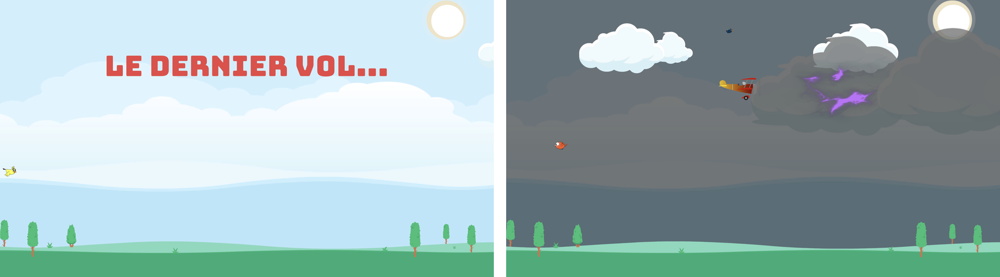

# Le Dernier Vol - 2D Cinematic Adventure



## Description
This project was developed as part of an **Introduction to Video Game Programming** course. The project involves creating a 2D cinematic experience using `Unity`, focusing on the integration of animations, sound effects, and visual assets. The game uses custom `C#` scripts to control animations, audio, and scene transitions, demonstrating foundational game programming techniques.

## Key Features

### Environment
- **2D Cinematic**:
  - A visually engaging 60-second animation using a combination of free and custom assets.
- **Assets and Media**:
  - Incorporates various free-to-use assets for graphics and audio.
  - Custom end-screen visuals created in-house.

### Animation
- At least **5 different images** and **5 distinct sounds**.
- **Frame-by-frame animations** for dynamic visuals.
- **Interpolations** (minimum five) across:
  - Position.
  - Rotation.
  - Scale.

### Audio
- Background music changes based on the scene's context (e.g., light or dark mood).
- Interactive sound effects for key events, such as explosions and thunder.

### C# Scripting
- Custom scripts manage:
  - **Animation Interpolations**:
    - Smooth movements, rotations, and scaling of objects.
  - **Color and Opacity Control**:
    - Background color changes dynamically over time.
  - **Audio Management**:
    - Scripts handle at least three audio components, syncing them with animations.
  - **Text Animation**:
    - Scripts for displaying text dynamically during the cinematic.
  - **Event-based Object Behavior**:
    - Object animations (e.g., clouds, planes, and birds) are tied to script-based triggers.

### Cinematic Structure
- The cinematic progresses through multiple event-driven animations, ending with a custom final animation.

## Requirements
- **Unity Version**: `LTS 2022.3.40f1`
- All media must be **royalty-free** or original creations.

## Assets Used
### Graphics
- **Font**: [Bungee Tint](https://fonts.google.com/specimen/Bungee+Tint)
- **Airplane**: [Biplane](https://freesvg.org/biplane-2)
- **Background and Elements**: [Kenney's Background Elements](https://kenney.nl/assets/background-elements-redux)
- **Birds**: 
  - [Cute Birds](https://assetstore.unity.com/packages/2d/characters/2d-cute-birds-4-in-1-mini-pack-237273)
  - [Cartoon Birds](https://assetstore.unity.com/packages/2d/characters/2d-cartoon-birds-pack-149167)
- **Explosion**: [Simple Explosion](https://opengameart.org/content/simple-explosion-bleeds-game-art)
- **Lightning**: [Kenney's Particle Pack](https://kenney.nl/assets/particle-pack)

### Audio
- **Music**:
  - [Happy Theme](https://www.bensound.com/royalty-free-music/track/country-boy) - License: B2XFFSQXQD8ITGCC
  - [Dark Theme](https://www.bensound.com/royalty-free-music/track/crime-scene-dark-suspenseful) - License: 1ZDJ5FIZIQZC26WS
- **Sound Effects**:
  - [Bird Chirps](https://freesound.org/people/fleurescence/sounds/578858/)
  - [Thunderstorm](https://soundbible.com/916-Perfect-Thunder-Storm.html)
  - [Explosion](https://freesound.org/people/sandyrb/sounds/95078/)

## Scripts Overview
### Non-Animated Scripts
- **Text Animation**: `AfficherTexte.cs`
- **Background Color Control**: `CouleurCiel.cs`
- **Audio Management**: `Audio.cs`
- **Plane Movement**: 
  - `DeplacementDroiteDelai.cs`
  - `RotationAvionDelai.cs`
- **Clouds**:
  - `DeplacementGaucheArret.cs`
  - `DeplacementGaucheDelaiArret.cs`
- **Lightning Effects**:
  - `FoudreFlash.cs`
  - `FoudreFlashInverse.cs`
- **Game End**: `FinDuJeu.cs`

### Animated Scripts
- **Birds Movement**:
  - `DeplacementDroiteArret.cs`
  - `DeplacementDroiteDelai.cs`
  - `DeplacementGaucheDelai.cs`
- **Explosion Animation**: `Explosion.cs`

## How to Play
Clone the repository:
   ```bash
   git clone https://github.com/yonahcodes/LeDernierVol.git
   ```
